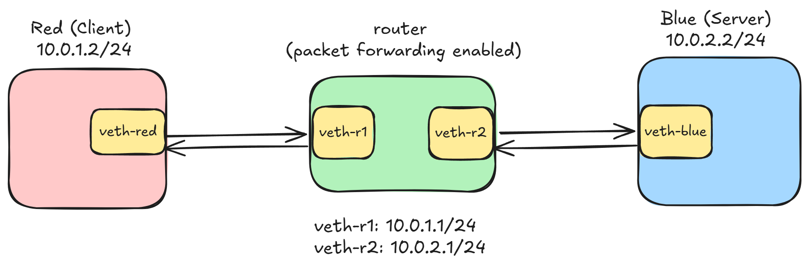

# 🔐 TLS Handshake Analysis Using Linux Network Namespaces (Layer 3 Routing)


---

## 🚀 Motivation

This project was created to deeply understand:
- Layer 3 routing behavior
- TCP 3-way handshake mechanics
- TLS handshake process
- Encryption boundary after Change Cipher Spec
- Packet-level protocol inspection using Wireshark

Instead of relying on a physical network, Linux network namespaces were used to simulate a routed Layer-3 environment.

---

## 📌 Overview

This project demonstrates TCP and TLS handshake analysis over a routed Layer-3 topology using Linux network namespaces.

The topology simulates:

Client (red namespace) → Router → Server (blue namespace)

It captures and analyzes:

- TCP 3-way handshake
- TLS handshake
- Certificate exchange
- Encryption boundary
- TTL decrement across router

---

## 🗺 Network Topology

```
red (10.0.1.2)  ── veth ──  router  ── veth ──  blue (10.0.2.2)
```

Subnets:

- 10.0.1.0/24
- 10.0.2.0/24




---

## ⚙️ Setup

Run:

```bash
sudo ./setup.sh
```

Test connectivity:

```bash
sudo ip netns exec red ping 10.0.2.2
```

---

## 🔐 TLS Experiment

Start server (blue):

```bash
sudo ip netns exec blue openssl s_server -key blue_namespace/key.pem -cert blue_namespace/cert.pem -accept 4433
```

Start client (red):

```bash
sudo ip netns exec red openssl s_client -connect 10.0.2.2:4433
```

---

## 📡 Packet Capture

Capture using:

```bash
sudo ip netns exec router tcpdump -i veth-r1 -w tls_capture.pcap
```

Open in Wireshark and use filters:

```
tcp.port == 4433
tls
```

---

## 🔍 Key Observations

- TCP 3-way handshake observed
- TLS ClientHello and ServerHello exchanged
- Certificate transmitted in plaintext
- Encryption begins after Change Cipher Spec
- TTL decreases from 64 to 63 (Layer 3 routing proof)

---

## 🎓 Learning Outcomes

- Layer 2 vs Layer 3 packet forwarding
- TCP connection establishment
- TLS handshake mechanics
- Symmetric encryption boundary
- Routing and TTL analysis

---

## 🧹 Cleanup

```bash
sudo ./cleanup.sh
```

---

## 📂 Structure

```
blue_namespace/
screenshots/
report/
setup.sh
cleanup.sh
README.md
```   

## 🔗 Lecture Source: Network Namespaces - Session 1
https://nitkeduin-my.sharepoint.com/:v:/g/personal/tahiliani_nitk_edu_in/EZsxo6VafiBIn3ybNUNOYPYBJ9Oe7nvBMFc81vTTC-FhtQ?e=b16yGn&nav=eyJyZWZlcnJhbEluZm8iOnsicmVmZXJyYWxBcHAiOiJTdHJlYW1XZWJBcHAiLCJyZWZlcnJhbFZpZXciOiJTaGFyZURpYWxvZy1MaW5rIiwicmVmZXJyYWxBcHBQbGF0Zm9ybSI6IldlYiIsInJlZmVycmFsTW9kZSI6InZpZXcifX0%3D